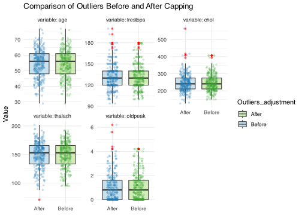
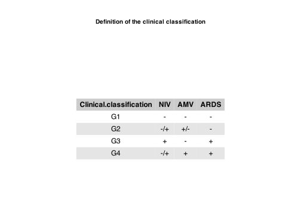
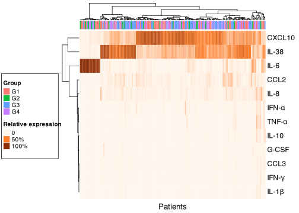
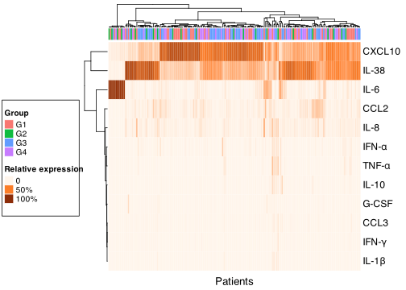

# Load necessary libraries


``` r
library(openxlsx)
library(dplyr)
library(mice)
library(ComplexHeatmap)
library(circlize)
library(grid)
library(RColorBrewer)
library(ggplot2)
library(reshape2)
library(DataExplorer)
library(summarytools)
library(DescTools)
library(mlbench)
library(ggh4x)
library(GGally)
library(corrplot)
library(tidyverse)
library(modeest)
library(patchwork) 
library(gridExtra)
library(cowplot)
```

# Analysis of the Heart Disease Dataset 

*Load the data from [here](https://raw.githubusercontent.com/jpinero/DMI_2021/main/datasets/heart_disease_dataset.csv), and the description is [here](https://raw.githubusercontent.com/jpinero/DMI_2021/main/datasets/heart_disease_description.txt).*
*The original dataset comes from [here](https://archive.ics.uci.edu/ml/datasets/Heart+Disease) and corresponds to the [processed cleveland data](https://archive.ics.uci.edu/ml/machine-learning-databases/heart-disease/processed.cleveland.data)*
      
## Perform an EDA on the dataset

### Data preprocessing

As a first step we will preprocess the heart disease dataset by reading the data and setting up the data structure. 

This data consists of 303 records (samples) and 15 fields (variables) including the patients IDs. From these 14, on the original article 13 work as explanatory variables of the dependent variable, which is num (Diagnosis of Heart Disease). By using `plot_intro()`, we can have an introductory visualization of the dataset.


``` r
file_path <- "data/heart_disease_dataset.csv"
data_hd <- read.table(file_path, sep = " ", header = TRUE, na.strings = "?")
dim(data_hd) 
```

```
## [1] 303  15
```

``` r
rownames(data_hd) <- data_hd$patient_id
data_hd <- data_hd[1:14]

data_hd$sex <- factor(data_hd$sex, levels = c(0, 1), 
                      labels = c("female", "male"))
data_hd$cp <- factor(data_hd$cp, levels = c(1, 2, 3, 4), 
                     labels = c("typical angina", "atypical angina", 
                                "non-anginal pain", "asymptomatic"))
data_hd$fbs <- factor(data_hd$fbs, levels = c(0, 1), 
                      labels = c("false", "true"))
data_hd$restecg <- factor(data_hd$restecg, levels = c(0, 1, 2), 
                          labels = c("normal", "ST-T wave abnormality", 
                                     "left ventricular hypertrophy"))
data_hd$exang <- factor(data_hd$exang, levels = c(0, 1), 
                        labels = c("no", "yes"))
data_hd$slope <- factor(data_hd$slope, levels = c(1, 2, 3), 
                        labels = c("upsloping", "flat", "downsloping"))
data_hd$thal <- factor(data_hd$thal, levels = c(3, 6, 7), 
                       labels = c("normal", "fixed defect", "reversible defect"))
data_hd$num <- factor(ifelse(data_hd$num == 0, "No disease", "Disease"))
data_hd$ca <- factor(data_hd$ca, levels = c(0, 1, 2, 3))

plot_intro(data_hd)
```

<!-- -->

In the previous plot, we can also appreciate that there are some missing values. Using `plot_missing()` we can see how all the present missing observations, are from *thal* and *ca* variables. In order to deal with them, we will impute them:


``` r
plot_missing(data_hd)
```

<!-- -->

``` r
imp_hd <- mice(data_hd, method = "rf")
imp_data_hd <- complete(imp_hd)
```

Then, to correct outliers, we can winsorise extreme values, by capping at the 1st and 99th percentile:

- With the function `identify_outliers()` we will identify and collect outliers from the numeric columns of the *imp_data_hd* data frame.

- Then, using `pcap()` we will perform the capping of extreme values.

After treating the outliers we can visualize how the extreme values have been adjusted.


``` r
identify_outliers <- function(data) {
  outliers <- list()
  for (i in which(sapply(data, is.numeric))) {
    col_name <- names(data)[i]
    
    perc <- quantile(data[, i], c(.25, .75 ), na.rm =TRUE)
    lower_fence <- perc[1] - 1.5 * IQR(data[, i])
    upper_fence <- perc[2] + 1.5 * IQR(data[, i])
    
    outlier_indices <- which(data[, i] < lower_fence | data[, i] > upper_fence)
    outliers[[col_name]] <- data[outlier_indices, i]
  }
  outliers2 <- outliers[sapply(outliers, length)>0]
  return(outliers2)
}

pcap <- function(df, vars= NULL, percentiles = c(.01, .99)){
  if(is.null(vars)) {
    vars_index <- which(sapply(df, is.numeric))
    
  } else {
    vars_index <- which(names(df) %in% vars)
  }
  for (i in vars_index) {
    quantiles <- quantile( df[,i], percentiles, na.rm =TRUE)
    df[,i] = ifelse(df[,i] < quantiles[1] , quantiles[1], df[,i])
    df[,i] = ifelse(df[,i] > quantiles[2] , quantiles[2], df[,i])}
  return(df)
}
```


``` r
outs <- identify_outliers(imp_data_hd)
outs_vars <- names(outs) 
clean_hd <- pcap(imp_data_hd, vars = outs_vars) 

long_hd_before <- melt(imp_data_hd, na.rm = TRUE)
long_hd_after <- melt(clean_hd, na.rm = TRUE)
long_hd_before$Outliers_adjustment <- "Before"
long_hd_after$Outliers_adjustment <- "After"

ggplot(rbind(long_hd_before, long_hd_after), 
       aes(x = rev(Outliers_adjustment), y = value, fill = Outliers_adjustment)) +
  geom_boxplot(outlier.colour = "red", alpha = 0.6, outlier.size = 1) +  
  geom_jitter(width = 0.2, alpha = 0.2, size = 1, aes(color = Outliers_adjustment)) +  
  labs(title = "Comparison of Outliers Before and After Capping", x = NULL, y = "Value") +
  facet_wrap(~ variable, scales = "free_y", labeller = label_both) +  
  scale_fill_manual(values = c("Before" = "#a6cee3", "After" = "#b2df8a")) + 
  scale_color_manual(values = c("Before" = "#1f78b4", "After" = "#33a02c")) +
  theme(axis.text.x = element_blank(), axis.ticks.x = element_blank()) +  
  theme_minimal()
```

<!-- -->

### Univariate analysis

The following step is performing an univariate analysis on this variables. For the numerical ones, an analysis of their distribution will be assessed through an histogram and QQ plots. This will also help us to get information about the level of dispersion of the data. For the cathegorical data, we will asses what is the most common category in each of the variables, and also plot the frequencies in the form of bar plots.


#### Numerical variables

From the univariate analysis of numerical variables, the histograms show that they do not follow any specific distribution pattern that would resemble any of the classic distributions. We can also see that most variables display pronounced asymmetry, except for age. This can be quantified using the skewness measures from the descriptive analysis.
For example, age appears to be the more centered, but has a noticeble peak of people close to 60 years old. Also, thalach appears to have a distribution skewed to right and chol and trestbps skewed to left. Finally, oldpeak is extremely skewed to left with a clear 0-inflation. 

The QQ plots further supports the conclusion that the variables do not follow a normal distribution and highlights the presence of atypical observations, which are also visible in the boxplots presented earlier.


``` r
descr(clean_hd) 
```

```
## Descriptive Statistics  
## clean_hd  
## N: 303  
## 
##                        age     chol   oldpeak   thalach   trestbps
## ----------------- -------- -------- --------- --------- ----------
##              Mean    54.44   246.29      1.03    149.68     131.62
##           Std.Dev     9.04    48.82      1.12     22.44      17.17
##               Min    29.00   149.00      0.00     95.02     100.00
##                Q1    48.00   211.00      0.00    133.00     120.00
##            Median    56.00   241.00      0.80    153.00     130.00
##                Q3    61.00   275.00      1.60    166.00     140.00
##               Max    77.00   406.74      4.20    191.96     180.00
##               MAD     8.90    47.44      1.19     22.24      14.83
##               IQR    13.00    64.00      1.60     32.50      20.00
##                CV     0.17     0.20      1.09      0.15       0.13
##          Skewness    -0.21     0.59      1.02     -0.47       0.59
##       SE.Skewness     0.14     0.14      0.14      0.14       0.14
##          Kurtosis    -0.55     0.54      0.21     -0.43       0.23
##           N.Valid   303.00   303.00    303.00    303.00     303.00
##         Pct.Valid   100.00   100.00    100.00    100.00     100.00
```

``` r
plot_histogram(clean_hd, geom_histogram_args = list("fill" = "#a6cee3", "color" = "#1f78b4"), ggtheme = theme_minimal())
```

<!-- -->

``` r
plot_qq(clean_hd, geom_qq_line_args = list(color = "red"), ggtheme = theme_minimal())
```

<!-- -->

#### Categorical variables

Moving to the univariate analysis of categorical variables in the dataset, we can see how they overall exhibit an imbalance in the number of observations across the different categories, resulting in a lack of homogeneity among them. This unequal distribution could introduce bias or affect the generalizability of results.


``` r
clean_hd %>%
  select_if(is.factor) %>% 
  summarise_all(~ mlv(.))
```

```
##    sex           cp   fbs restecg exang     slope ca   thal        num
## 1 male asymptomatic false  normal    no upsloping  0 normal No disease
```

``` r
update_geom_defaults("bar", list(fill = "#a6cee3", color = "#1f78b4"))
plot_bar(clean_hd, ggtheme = theme_minimal())
```

<!-- -->

### Bivariate & multivariate analysis

#### Variables association with heart disease

##### Numerical variables

Now, for further investigating the relationships among the different variables, we can perform a bivariate/multivariate analysis. We will start doing an analysis to identify association with heart disease, for the numerical variables. This can be performed doing correlation plots for all the possible pairs of variables. We will include also in this part the categorical dependent variable num, thus performing at the same time the categorical-continuous bivariate analysis for the variable of interest. 


``` r
numvar <- clean_hd %>% 
  select(where(is.numeric), num)  

ggpairs(numvar, aes(color = num, fill = num), 
        upper = list(continuous = wrap("cor", size = 3, color = "black")),
        lower = list(continuous = wrap("points", alpha = 0.8, size = 1.5)),
        diag = list(continuous = wrap("densityDiag", alpha = 0.8)),progress = FALSE) +
  theme_minimal() +  
  theme(text = element_text(color = "black"),
        panel.grid.major = element_blank(),
        panel.grid.minor = element_blank(),
        panel.background = element_blank(),
        strip.background = element_blank(),
        axis.text.y = element_text(size = 8, color = "black"),
        axis.text.x = element_text(size = 8, angle = 45, hjust = 1, color = "black"),
        strip.text.x = element_text(size = 5, color = "black"),
        strip.text.y = element_text(size = 5, color = "black")) +
  scale_fill_manual(values = c("#a6cee3","#b2df8a")) + 
  scale_color_manual(values = c( "#1f78b4", "#33a02c")) 
```

<!-- -->

This analysis gives us a clear picture of how different numerical variables relate to the presence of coronary artery disease (CAD). 
One of the strongest findings is that maximum heart rate achieved (`thalach`) is significantly lower in people with CAD. This makes sense since heart disease can limit how much the heart can push itself during exertion. On the other hand, oldpeak is 0-inflated so it is difficult to deduce something about its relevance.  Then, other variables such as resting blood pressure (`trestbps`) and, surprisingly, cholesterol levels (`chol`) show a high level of overlapping among disease and no disease individuals. Maybe it is not as surprising as it could be expected, given that modern research has strongly proved that looking at overall levels of cholesterol is an oversimplification of the problem.  

The boxplots reinforce these patterns. People with CAD have lower median `thalach` values and higher `oldpeak` values, making these some of the most useful markers in this data set. `Resting blood pressure` is also slightly higher in the disease group, but since the distributions overlap quite a bit, it’s not a reliable predictor on its own.

Looking at the density and histogram plots, `age` emerges as another important factor, with older individuals being more likely to have CAD—something we would expect given how heart disease develops over time. `Cholesterol` and `resting blood pressure` have a lot of overlap between groups, meaning they don’t clearly separate those with and without disease. In summary, `thalach` is the most useful numerical features for identifying CAD, while `resting blood pressure` and `cholesterol`, though relevant, are less predictive on their own. Anyway, we can see that numerical variables are moderate to weak correlated to heart disease.

##### Categorical variables


``` r
cat_vars <- names(clean_hd)[sapply(clean_hd, is.factor)]
plot_categorical_vs_num <- function(data, dependent_var = "num") {
  cat_vars <- setdiff(cat_vars, dependent_var)
  plots <- list() 
  plot_index <- 1 
  
  for (var in cat_vars) {
    p <- ggplot(data, aes(x = .data[[var]], fill = .data[[dependent_var]])) +
      geom_bar(position = "dodge") +  
      scale_fill_manual(values = c("#a6cee3","#b2df8a")) + 
      scale_color_manual(values = c( "#1f78b4", "#33a02c")) +
      theme_minimal(base_size = 12) +
      theme(panel.background = element_blank(),
            panel.grid.major = element_blank(), 
            panel.grid.minor = element_blank(), 
            axis.text.x = element_text(angle = 30, hjust = 1, color = "black"),
            axis.text.y = element_text(color = "black"),
            axis.title.y = element_text(color = "black", face = "bold"),
            legend.title = element_text(face = "bold")) +
      labs(title = paste("Distribution of", dependent_var, "by", var),
           x = var, y = "Count", fill = dependent_var)
    plots[[plot_index]] <- p
    plot_index <- plot_index + 1
  }
  wrap_plots(plots) + 
    plot_annotation(title = paste("Bivariate Analysis of", dependent_var, 
                                  "vs. Categorical Variables"))
}

plot_categorical_vs_num(clean_hd)
```

<!-- -->

Based on the data displayed on the figure, `sex` doesn’t seem to be a strong predictor, as both men and women have similar proportions of disease cases. Nevertheless, chest pain type (`cp`) is highly relevant: asymptomatic individuals are much more likely to have CAD, while those with typical angina are mostly non-diseased. Exercise-induced angina (`exang`) is another strong indicator, as those who experience angina during exertion have a significantly higher likelihood of CAD.

ST segment slope (`slope`) and the number of affected vessels (`ca`) are among the best predictors. Flat or down-sloping ST segments are more common in CAD patients, and the more narrowed vessels detected, the higher the disease risk. The thalassemia test (`thal`) also plays a key role, with fixed and reversible defects strongly associated with CAD. On the other hand, fasting blood sugar (`fbs`) and resting ECG (`restecg`) show weaker differences between groups, meaning they may be risk factors but not primary indicators.
Overall, the strongest predictors appear to be chest pain type, exercise-induced angina, ST segment slope, and the number of affected vessels, while sex and fasting blood sugar are less useful for distinguishing disease presence. These findings align with what we know about CAD—factors related to exercise response, ST-segment changes, and vessel narrowing are key markers of risk.

In order to make a more objective interpretation of the association of categorical variables to heart disease, we will perform a Chi-squared test:


``` r
chi_sq <- map(select_if(clean_hd, is.factor) %>% 
                select(-num), ~ chisq.test(table(clean_hd$num, .x))$p.value)
chi_sq <- tibble(variable = names(chi_sq), p_value = unlist(chi_sq))
ggplot(chi_sq, aes(x = reorder(variable, p_value), y = -log10(p_value))) +
  geom_bar(stat = "identity") +
  coord_flip() +
  theme_minimal() +
  labs(x = "Variable", y = "-log10(p-value)", title = "Chi-Square Test Results")
```

<!-- -->

The results we obtained support our earlier interpretation. Based on the Chi-square test results for categorical variables, `ca` (Number of major vessels colored by fluoroscopy), `thal` (Thalassemia diagnosis), and `cp` (Chest pain type), may be the most significant predictors of heart disease in this dataset, and are the three most influential categorical variables in relation to heart disease:

<center>

<table style="border-collapse: collapse; width: 50%; text-align: center; border: 1px solid black;">
  <tr style="background-color: #d3d3d3;">
    <th style="padding: 5px; text-align: center; border: 1px solid black;"><strong>Variable</strong></th>
    <th style="padding: 5px; text-align: center; border: 1px solid black;"><strong>p-value</strong></th>
  </tr>
  <tr>
    <td style="padding: 5px; border: 1px solid black;">cp</td>
    <td style="padding: 5px; border: 1px solid black;">7.78e-14</td>
  </tr>
  <tr>
    <td style="padding: 5px; border: 1px solid black;">ca</td>
    <td style="padding: 5px; border: 1px solid black;">2.61e-18</td>
  </tr>
  <tr>
    <td style="padding: 5px; border: 1px solid black;">thal</td>
    <td style="padding: 5px; border: 1px solid black;">5.89e-18</td>
  </tr>
</table>
<br><br>
</center>


Based on the results, categorical variables like `ca`, `thal`, and `cp` appear to define heart disease better than numerical ones in this dataset. This could be caused by numerical variables not showing a clear threshold or direct diagnostic value as categorical ones, due to its variability in different individuals. However, numerical variables could still be critical in combination with categorical ones. To compare both numerical and categorical variables as predictors for heart disease, more advanced models such as logistic regression or machine learning could be used.

#### General analysis

##### Numerical variables

To further explore the levels of correlation between the numerical variables, we can analyze the following plot. 


``` r
numvar <- clean_hd %>% 
  select(where(is.numeric))  
corrplot(cor(numvar), method = 'ellipse', order = 'AOE', type = 'upper', tl.col = "black")
```

<!-- -->

As we can observe, neither strong positive or negative correlations are found among the different numerical variables used in the data set. This confirms that most of these features are weakly related to each other. 

##### Categorical variables

Now, let's move on to the bivariate categorical analysis. Due to the fact that there are a lot of categorical variables and, just as the bivariate analysis for numerical variables has demonstrated, firstly we will explore the intensity of correlation among all of them with Cramér’s V (based on chi-square test), which measures the strength of association between two categorical variables.  


``` r
cramer_matrix <- matrix(NA, ncol=length(cat_vars), nrow=length(cat_vars))
rownames(cramer_matrix) <- cat_vars
colnames(cramer_matrix) <- cat_vars

for (i in 1:length(cat_vars)) {
  for (j in 1:length(cat_vars)) {
    if (i <= j) {  
      cramer_matrix[i, j] <- CramerV(table(clean_hd[[cat_vars[i]]], clean_hd[[cat_vars[j]]]))
    } else {
      cramer_matrix[i, j] <- NA  
    }
  }
}

cramer_df <- as.data.frame(cramer_matrix)
cramer_df$Var1 <- rownames(cramer_df)
cramer_melted <- melt(cramer_df, id.vars = "Var1")
cramer_melted <- cramer_melted[!is.na(cramer_melted$value), ]
cramer_melted$Var1 <- factor(cramer_melted$Var1, levels = rev(cat_vars)) 
cramer_melted$variable <- factor(cramer_melted$variable, levels = cat_vars) 

ggplot(cramer_melted, aes(x = Var1, y = variable, fill = value)) +
  geom_tile(color = "white") +  
  scale_fill_gradient(low = "#fff", high = "#1f78b4", name = "Cramér’s V") +  
  theme_minimal() +
  theme(axis.text.x = element_text(angle = 45, hjust = 1, color = "black"),
        axis.text.y = element_text(color = "black"),
        axis.title.x = element_blank(),
        axis.title.y = element_blank(),
        panel.grid.major = element_blank(),
        panel.grid.minor = element_blank()) +
  labs(title = "Heatmap of Categorical Variable Associations (Cramér’s V)")
```

<!-- -->
This heatmap of Cramér’s V associations shows that, aside from the relationship between `num` and other categorical variables, there are no strong correlations among the explanatory categorical variables themselves.

The highest values appear between `num` and variables like `ca` (number of affected vessels), `thal` (thalassemia test), `exang` (exercise-induced angina), and `cp` (chest pain type). This reinforces their relevance in predicting CAD. However, the remaining variable-to-variable correlations are relatively low, meaning that most explanatory variables are independent of each other and don’t strongly influence one another. 

##### Numerical-categorical variables

Finally, we will perform some bivariate analysis over some continuous-categorical relationships. We can use this for example with categorical data which is rather descriptive than predictive in the data set, such as `sex` or `restecg`, to see what is the distribution of the continuous variables over these ones. 


``` r
data_long <- clean_hd %>%
  select(where(is.numeric), sex) %>%
  pivot_longer(cols = -sex, names_to = "Variable", values_to = "Value")

ggplot(data_long, aes(x = sex, y = Value)) +
  geom_violin(fill = "cornflowerblue", alpha = 0.7) +
  geom_boxplot(width = 0.15, fill = "orange", outlier.color = "orange", outlier.size = 2) + 
  labs(title = "Distribution of Numeric Variables by Sex") +
  facet_wrap(~Variable, scales = "free") +
  theme_minimal() +
  theme(axis.text.x = element_text(angle = 30, hjust = 1),
        strip.text = element_text(face = "bold"))
```

<!-- -->

The analysis of numeric variables by sex reveals some key differences in cardiovascular traits. Males tend to have higher resting blood pressure (`trestbps`) and lower maximum heart rates (`thalach`), which may indicate a higher cardiovascular risk. Cholesterol (`chol`) levels show more variability in females, while `oldpeak` (ST depression) appears similar between sexes, suggesting that ischemic response to exercise is not strongly sex-dependent. Overall, the most noticeable differences are in heart rate and blood pressure, both of which align with known physiological and cardiovascular risk patterns.


``` r
data_long <- clean_hd %>%
  select(where(is.numeric), restecg) %>%
  pivot_longer(cols = -restecg, names_to = "Variable", values_to = "Value")

ggplot(data_long, aes(x = restecg, y = Value)) +
  geom_violin(fill = "cornflowerblue", alpha = 0.7) +
  geom_boxplot(width = 0.15, fill = "orange", outlier.color = "orange", outlier.size = 2) + 
  labs(title = "Distribution of Numeric Variables by Resting Electrocardiographic Results") +
  facet_wrap(~Variable, scales = "free") +
  theme_minimal() +
  theme(
    axis.text.x = element_text(angle = 30, hjust = 1),
    strip.text = element_text(face = "bold"))
```

<!-- -->

The analysis of numeric variables by `restecg` (resting ECG results) highlights more heterogeneous patterns. In general, it can be observed that the distributions of the data are much more diverse. For example: individuals with left ventricular hypertrophy tend to have higher resting blood pressure (`trestbps`) and lower maximum heart rates (`thalach`) compared to normal individuals. This aligns with known cardiovascular stress indicators, so it is not a novelty. ST-T wave abnormalities are associated with a wider spread in `oldpeak` (ST depression), suggesting ischemic effects. However, cholesterol (`chol`) and `age` distributions remain with a similar mean (although different distributions of data) across all ECG categories, indicating that `restecg` alone may not be a strong predictor of lipid levels or aging. Overall, ECG abnormalities, especially left ventricular hypertrophy, seem linked to factors associated with heart disease progression.


# Difference in mortality rates in hospitalized COVID-19 patients 

*Using the supplementary material from the [Difference in mortality rates in hospitalized COVID-19 patients identified by cytokine profile clustering using a machine learning approach: An outcome prediction alternative](https://www.frontiersin.org/articles/10.3389/fmed.2022.987182/full), perform the following tasks:*

## Data preparation


``` r
file_path <- "data/cov_19_metadata.xlsx"
data_meta <- read.xlsx(file_path, sheet = 1, startRow = 2, na.strings = c("NI", "ND")) 

data_meta <- data_meta %>% distinct()
data_meta <- data_meta %>% 
  group_by(ID) %>% 
  filter(n() == 1) %>% 
  ungroup()

s_data_meta <- data_meta[, c(1:3, 9:10, 13:16, 18)]

s_data_meta$ARDS.Diagnosis <- ifelse(is.na(s_data_meta$ARDS.Diagnosis) & 
                                       s_data_meta$Days.with.ARDS == 0, "No",
                              ifelse(is.na(s_data_meta$ARDS.Diagnosis) & 
                                       s_data_meta$Days.with.ARDS > 0, "Yes",
                                           s_data_meta$ARDS.Diagnosis))
s_data_meta$Use.of.NIV <- ifelse(is.na(s_data_meta$Use.of.NIV) & 
                                   s_data_meta$Days.with.NIV == 0, "No",
                          ifelse(is.na(s_data_meta$Use.of.NIV) & 
                                   s_data_meta$Days.with.NIV > 0, "Yes",
                                       s_data_meta$Use.of.NIV))

s_data_meta[["Gender"]] <- factor(s_data_meta[["Gender"]], levels = c("M", "F"))
categoricals <- c("ARDS.Diagnosis", "Use.of.NIV", "Use.of.AMV", "Death")
for (col in categoricals) {
  s_data_meta[[col]] <- factor(s_data_meta[[col]], levels = c("No", "Yes"))
}

s_data_meta <- s_data_meta %>%
  mutate(Group = factor(case_when(
    Use.of.NIV == "No" & Use.of.AMV == "No" & ARDS.Diagnosis == "No" ~ "G1",
    Use.of.NIV == "Yes" & Use.of.AMV == "No" & ARDS.Diagnosis == "Yes" ~ "G3",
    Use.of.AMV == "Yes" & ARDS.Diagnosis == "Yes" ~ "G4",
    ARDS.Diagnosis == "No" ~ "G2",
    TRUE ~ NA_character_  
  )))

s_data_meta <- s_data_meta %>%
  filter(!is.na(ARDS.Diagnosis) & !is.na(Use.of.NIV) & !is.na(Death) & !is.na(Group))
```

## Reproduce Figure 1 from the publication
*(Whole code available in the md file)*


``` r
# Combinarion of the panels into a grid layout
lay <- rbind(c(1, 3, 2),  c(1, 3, 3))
final_figure <- plot_grid(
  plot_grid(plot_a, panel_b_cowplot, labels = c("A", "B"), ncol = 2), 
  plot_grid(plot_c, plot_d, labels = c("C", "D"), ncol = 2),  
  ncol = 1,  
  rel_heights = c(1, 1.4))

final_figure
```

<!-- -->

## Reproduce Figure 2 from the publication
*but instead of representing the clusters in the annotation, represent the groups (G1 to G4)*


``` r
file_path <- "data/cov_19_cytokine.xlsx"
data_ck <- read.xlsx(file_path, startRow = 2, 
                     na.strings = c("NI", "ND"), fillMergedCells = TRUE)

colnames(data_ck)[1] <- "ID"
data_ck[2:ncol(data_ck)] <- lapply(data_ck[2:ncol(data_ck)], as.numeric)
data_ck$ID <- trimws(as.character(data_ck$ID)) 
data_ck$ID <- gsub("HSDJ", "HSJD", data_ck$ID) 

data_ck <- data_ck %>%
  group_by(ID) %>% 
  summarise(across(.cols = everything(), .fns = ~ median(.x, na.rm = TRUE)))  
imp_ck <- mice(data_ck)
imp_data_ck <- complete(imp_ck)
s_imp_ck <- imp_data_ck[, c(1,3:14)]

s_imp_ck <- merge(s_imp_ck, s_data_meta[, c("ID", "Group", "Death", "Gender")], 
                  by = "ID", all.x = TRUE)
s_imp_ck <- subset(s_imp_ck, !is.na(Group))

hm_data <- t(s_imp_ck[, 2:13]) 
```


``` r
pc_data <- apply(hm_data, 2, function(x) (x / sum(x)) * 100)

ann_1 <- data.frame(Group = s_imp_ck$Group)
ha_1 <- HeatmapAnnotation(df = ann_1, show_annotation_name = FALSE,
                       col = list(Group =  c("G1" = "#F87772", "G2" = "#0FBC40", 
                                             "G3" = "#629CFF", "G4" = "#C77CFF")))

cols <- c("#FFF5EB", "#FB7D28", "#8C2D09")

ht1 <- Heatmap(pc_data,
              top_annotation = ha_1,
              col = colorRamp2(c(0, 50, 100), cols),
              column_title = "Patients",
              column_title_side = "bottom",
              show_column_names = F,
              show_heatmap_legend = F)

lgd_col_1 <- Legend(
  title = "Relative expression",
  at = c(0, 50, 100),
  labels = c("0", "50%", "100%"),
  legend_gp = gpar(fill = cols))
p_leg_1 <- packLegend(lgd_col_1, direction = "vertical")

draw(ht1, annotation_legend_list = p_leg_1, annotation_legend_side = "left")
grid.rect(x = 0.1, y = 0.455, width = 0.19, height = 0.4, 
          just = "center", gp = gpar(lwd = 1, col = "black", fill = NA))  
```

<!-- -->

## Improve figure 2 of the publication
*Add a second annotation with information of death and a third one with information of gender*

To improve the *Figure 2* of the publication, we have scaled the data and used a diverging color scale, as well as colorblind-friendly palettes for the annotations. We also improved the general aesthetics of the heatmap.


``` r
ann_2 <- cbind(ann_1, Death = s_imp_ck$Death, Gender = s_imp_ck$Gender)
set2 <- brewer.pal(6, "Set2")  
ha_2 <- HeatmapAnnotation(df = ann_2, 
                          show_legend = F,
                          col = list(Group = c("G1" = set2[1], "G2" = set2[2], 
                                               "G3" = set2[5], "G4" = set2[6]),
                                     Death =  c("No" = "#eee", "Yes" = "#000"),
                                     Gender =  c("M" = set2[3], "F" = set2[4])))

col_fun <- colorRamp2(c(-3.2, 0, 3.2), c(rev(brewer.pal(9, name = "RdBu"))[1], 
                                         "white", rev(brewer.pal(9, name = "RdBu"))[9]))

ht2 <- Heatmap(scale(hm_data), 
               top_annotation = ha_2,
               col = col_fun,
               column_title = "Patients",
               column_title_side = "bottom",
               row_title = "Cytokines",
               row_title_side = "right",
               show_column_names = F, 
               show_heatmap_legend = F)

lgd_col_2 <- Legend(title = "Relative expression",
                  at = c(-4, -2, 0, 2, 4),
                  col_fun = col_fun, 
                  legend_height = unit(2.75, "cm"))
lgd_group <- Legend(title = "Group",
                    labels = c("G1", "G2", "G3", "G4"),
                    legend_gp = gpar(fill = c(set2[1], set2[2], set2[5], set2[6])))
lgd_death <- Legend(title = "Death",
                    labels = c("No", "Yes"),
                    legend_gp = gpar(fill = c("#eee", "#000")))
lgd_gender <- Legend(title = "Gender",
                     labels = c("M", "F"),
                     legend_gp = gpar(fill = c(set2[3], set2[4])))
p_leg_2 <- packLegend(lgd_col_2, lgd_group, lgd_death, lgd_gender)

draw(ht2, annotation_legend_list = p_leg_2)
```

<!-- -->


# session info {.unnumbered}

R version 4.4.2 (2024-10-31)
Platform: aarch64-apple-darwin20
Running under: macOS Sequoia 15.0.1

Matrix products: default
BLAS:   /Library/Frameworks/R.framework/Versions/4.4-arm64/Resources/lib/libRblas.0.dylib 
LAPACK: /Library/Frameworks/R.framework/Versions/4.4-arm64/Resources/lib/libRlapack.dylib;  LAPACK version 3.12.0

locale:
[1] en_US.UTF-8/en_US.UTF-8/en_US.UTF-8/C/en_US.UTF-8/en_US.UTF-8

time zone: Europe/Madrid
tzcode source: internal

attached base packages:
[1] grid      stats     graphics  grDevices utils     datasets  methods  
[8] base     

other attached packages:
 [1] cowplot_1.1.3         gridExtra_2.3         patchwork_1.3.0      
 [4] modeest_2.4.0         lubridate_1.9.4       forcats_1.0.0        
 [7] stringr_1.5.1         purrr_1.0.4           readr_2.1.5          
[10] tidyr_1.3.1           tibble_3.2.1          tidyverse_2.0.0      
[13] corrplot_0.95         GGally_2.2.1          ggh4x_0.3.0          
[16] mlbench_2.1-6         DescTools_0.99.59     summarytools_1.0.1   
[19] DataExplorer_0.8.3    reshape2_1.4.4        ggplot2_3.5.1        
[22] RColorBrewer_1.1-3    circlize_0.4.16       ComplexHeatmap_2.20.0
[25] mice_3.17.0           dplyr_1.1.4           openxlsx_4.2.8       
[28] BiocManager_1.30.25  

loaded via a namespace (and not attached):
  [1] rstudioapi_0.17.1   jsonlite_1.9.0      shape_1.4.6.1      
  [4] magrittr_2.0.3      jomo_2.7-6          magick_2.8.5       
  [7] farver_2.1.2        nloptr_2.1.1        rmarkdown_2.29     
 [10] GlobalOptions_0.1.2 vctrs_0.6.5         Cairo_1.6-2        
 [13] minqa_1.2.8         base64enc_0.1-3     htmltools_0.5.8.1  
 [16] haven_2.5.4         broom_1.0.7         cellranger_1.1.0   
 [19] mitml_0.4-5         sass_0.4.9          bslib_0.9.0        
 [22] htmlwidgets_1.6.4   plyr_1.8.9          rootSolve_1.8.2.4  
 [25] cachem_1.1.0        networkD3_0.4       igraph_2.1.4       
 [28] lifecycle_1.0.4     iterators_1.0.14    pkgconfig_2.0.3    
 [31] Matrix_1.7-2        R6_2.6.1            fastmap_1.2.0      
 [34] rbibutils_2.3       clue_0.3-66         digest_0.6.37      
 [37] Exact_3.3           colorspace_2.1-1    spatial_7.3-18     
 [40] S4Vectors_0.42.1    labeling_0.4.3      timechange_0.3.0   
 [43] httr_1.4.7          compiler_4.4.2      proxy_0.4-27       
 [46] withr_3.0.2         doParallel_1.0.17   pander_0.6.5       
 [49] backports_1.5.0     ggstats_0.8.0       pan_1.9            
 [52] MASS_7.3-64         rjson_0.2.23        fBasics_4041.97    
 [55] gld_2.6.7           tools_4.4.2         ranger_0.17.0      
 [58] zip_2.3.2           nnet_7.3-20         glue_1.8.0         
 [61] stabledist_0.7-2    nlme_3.1-167        checkmate_2.3.2    
 [64] cluster_2.1.8       generics_0.1.3      gtable_0.3.6       
 [67] tzdb_0.4.0          class_7.3-23        data.table_1.16.4  
 [70] lmom_3.2            hms_1.1.3           rmutil_1.1.10      
 [73] BiocGenerics_0.50.0 foreach_1.5.2       pillar_1.10.1      
 [76] splines_4.4.2       pryr_0.1.6          lattice_0.22-6     
 [79] survival_3.8-3      tidyselect_1.2.1    knitr_1.49         
 [82] reformulas_0.4.0    IRanges_2.38.1      stats4_4.4.2       
 [85] xfun_0.51           expm_1.0-0          timeDate_4041.110  
 [88] rapportools_1.1     matrixStats_1.5.0   stringi_1.8.4      
 [91] yaml_2.3.10         boot_1.3-31         evaluate_1.0.3     
 [94] codetools_0.2-20    timeSeries_4041.111 tcltk_4.4.2        
 [97] cli_3.6.4           rpart_4.1.24        Rdpack_2.6.2       
[100] munsell_0.5.1       jquerylib_0.1.4     Rcpp_1.0.14        
[103] readxl_1.4.3        stable_1.1.6        png_0.1-8          
[106] parallel_4.4.2      lme4_1.1-36         glmnet_4.1-8       
[109] mvtnorm_1.3-3       scales_1.3.0        e1071_1.7-16       
[112] statip_0.2.3        crayon_1.5.3        GetoptLong_1.0.5   
[115] rlang_1.1.5        
